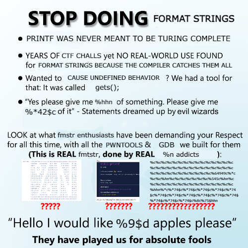

## Recap
- Top 20 or 30, I think? I was just playing for fun tbh xD, same as my team.  
- Nothing too hard, not bad.  

### Pwn
- **`l1t`**: Standard printf chall, leak GOT’s address, get libc version and ROP, never gets old (it does get old).  
- **`distilled-printf`**: l1t but the author gave you the libc, doesn’t use BOF.  
- **`no-nonsense`**: Now we’re talking. Reminds me to re-study `ret2dlresolve`. Overwrite some str and *tadaa*, you got shell xD. WTF pwn.  
- **`permutation`**: Get this misc chall out of my face, just remember all mem is zero at first :)  
- **`the-mound`**: "Heap chall"  this is a good one fr fr, no cap. Good shit.  

## Overall
- [STOP DOING FORMAT STRINGS](https://eth007.me/blog/ctf/stiller-printf/)  

