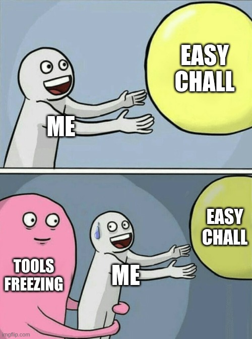

## Steps
- i did random stuff until
- first i saw the static method that inits everything and setps up some global strings used for printing later, the author put it there to waste our time or smth, i donno
    - anyhow i made the decoders, check `decoder.py`
    - one of the functions uses the file name to extract `hidden info`, but the file name is `BadApple.java` so he changed it somehow, i got the real file name by luck when i exported `jadx` data into a file `BadApplePlayer-jadx-readable.java`, pretty useful info
- after that waste of time, i jumpted to the other functions, one does `huffman-19` encoding and the other `huffman-20`, only `19` is used tho!!!!!!!
- next i jumped the the main function, it sets up some binary data `compressed frames` and `music file`, those are the ones that are breaking my editors xD
- i wrote a script to extract the `compressed frames`, its `extract_frames.py` and output `data2-extract`
- and here, i m done, i understand the code and i understand how he is doing stuff, but still i dont know how to solve the chall, so i thought maybe he is using setting some wrong info in the frames which corruptes the flow and messes up the rendering
- so i wrote the same shit he did in python, its in `runner.py`, a extract replica for his `java shit`
- and priting the data he is using i still didnt find shit, its all the same, i guess the same corruption and nothing is wrong with the info he is using

and here the event ended so i want able to finish

- anyhow the solve for the chall was to use `huffman-20` instead of the `huffman-19` he was using, maybe if i had enough time i wouldve guessed it, but unfortunately i didnt

## Final thoughts
- this chall got `0 solves` (was gonna be `1` if i got one or two more hours), but its idea is simple, i think ppl just didnt like how thier tools kept crashing or smth

welp at least i got a cool `bad apple` tool out of it :D

## Files
- `BadApplePlayer.java`: original, used some java decompiler to get it
- `BadApplePlayer-clean.java`:  original but without huge string, so no crashes
- `BadApplePlayer-jadx-readable.java`: readable jadx code, the best

- `data2-extract`: extracted compressed frames
- `extract_frames.py`: reads `BadApplePlayer.java` and extracts the frames
- `runner.py`: the extract replica of the application
- `frames_data`: debug stuff to make sure data is not corrupted, it was not

